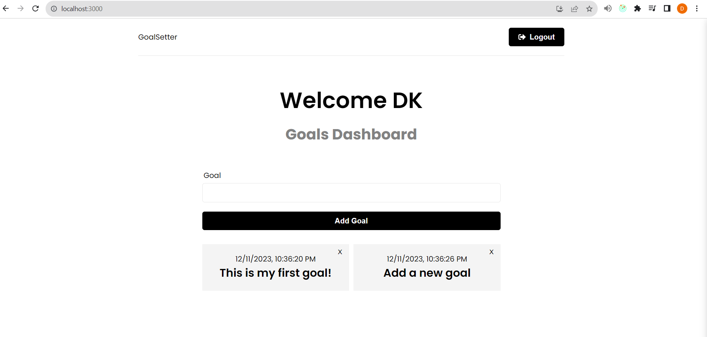

# Goal Setter App

This is a web application that allows users to set, update and delete goals. Users can create an account, add goals, view and delete a goal once its done. This application is built using the MERN stack (MongoDB, Express, React, Node.js) and JWT.

## Installation

To install and run this project, follow these steps:

    Clone this repository: git clone https://github.com/divyakanabar/GoalSetter_MERN.git
    Install dependencies for the server: cd server && npm install
    Install dependencies for the client: cd client && npm install
    Update the MONGODB_URI variable in backend/config/db.js file
    Update the NODE_ENV variable to development in backend/middleware/errorMiddleware.js
    Update the PORT variable to 5000 in backend/server.js
    Update the JWT_SERECT to yourJWT_SERECT in backend/controllers/userController.js & backend/middleware/authMiddleware.js
    Start the server: cd server && npm start
    Start the client: cd client && npm start

## Usage

Once the server and client are running, open a web browser and navigate to http://localhost:${PORT}. From there, you can:

    Register for an account
    Login to your account
    Add a goal
    Browse or delete your goals

## Features

This web application has the following features:

    User authentication: users can register and login to their account.
    Goals list: users can add and delete their goals.

## Contact

If you have any questions or feedback, please contact me at divyakanabar9@gmail.com
